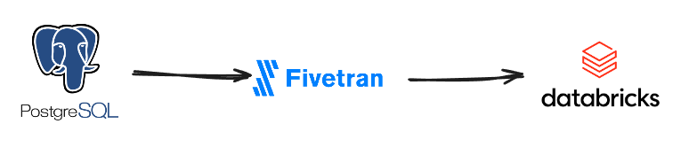

# Arquitetura Medallion no Databricks

Este projeto foi criado como um primeiro exercício de uso do Databricks, com o objetivo de explorar os principais recursos da plataforma — incluindo criação de schemas, execução de queries SQL, notebooks e gestão de dados em Lakehouse.

Os dados de exemplo foram extraídos de um arquivo `.csv` de uma empresa fictícia chamada [Contoso](https://learn.microsoft.com/pt-br/microsoft-365/enterprise/contoso-overview?view=o365-worldwide), através da [Base de Dados](https://github.com/sql-bi/Contoso-Data-Generator-V2-Data/releases/tag/ready-to-use-data) que consiste em uma empresa multinacional com sede em Paris. A empresa é uma organização de manufatura, vendas e suporte.

# 1 - Configuração do ambiente
Primeiro foi criado os esquemas onde as tabelas serão armazenadas. Para isso, foi adicionado uma pasta com um notebook para criar os esquemas `raw, bronze, silver e gold` dentro do catálogo `first_project`

```sql
%sql
use catalog first_project;
create schema if not exists raw_public;

create schema if not exists bronze;

create schema if not exists silver;

create schema if not exists gold;
```

Criando gestão de acesso, definindo quem pode acessar quais dados, recursos e ações dentro da plataforma.

```sql
%sql
-- Dando acesso ao esquema raw_public apenas para data_engineers
-- raw_public (data_engineers)
grant all privileges on schema first_project.raw_public to data_engineers;

-- bronze (data_engineers e data_analysts)
grant all privileges on schema first_project.bronze to data_engineers;
grant use schema on schema first_project.bronze to data_analysts;

-- silver (data_engineers, data_analysts, data_scientists)
grant all privileges on schema first_project.silver to data_engineers;
grant use schema on schema first_project.silver to data_analysts;
grant use schema on schema first_project.silver to data_scientists;

-- gold (todos)
grant all privileges on schema first_project.gold to data_engineers;
grant use schema on schema first_project.gold to data_analysts;
grant use schema on schema first_project.gold to data_scientists;
grant use schema on schema first_project.gold to business_users;
```

# 2 - Ingestão de dados
Para simular um ambiente de produção, os dados estão armazenados em um banco de dados PostgreSQL no [Supabase](https://supabase.com/).

Para realizar a ingestão dos dados do PostgreSQL para o Databricks, será utilizado o Fivetran, utilizando seus conectores.



A ingestão será realizada na camada raw, como apresentado no esquema abaixo:


# 3 - Modelagem dos dados

### Camada Bronze
A camada Bronze armazena os dados em formato estruturado, mantendo sua integridade original, mas com ajustes mínimos para garantir consistência de tipos e formatos.

As seguintes tabelas são utilizadas no modelo:

| Tabela           | Descrição                                       |
|------------------|-------------------------------------------------|
| customer         | Dados cadastrais de clientes                    |
| orders           | Informações sobre os pedidos realizados         |
| orderrows        | Detalhamento de itens de cada pedido            |
| sales            | Registros consolidados de vendas                |
| currencyexchange | Taxas de câmbio utilizadas nas transações       |
| products         | Catálogo de produtos disponíveis                |
| store            | Dados de lojas e pontos de venda                |

O relacionamento entre as tabelas pode ser visto no diagrama abaixo.


### Camada Silver
A camada Silver é responsável por tratar, limpar e integrar os dados vindos da camada Bronze, aplicando regras de negócio e garantindo qualidade e consistência.
Nesta etapa, os dados deixam de estar apenas padronizados e passam a estar confiáveis e prontos para análises intermediárias ou para alimentar a camada Gold.

### Camada Gold
A camada Gold é o nível mais alto da arquitetura Medallion e tem como principal objetivo fornecer dados prontos para análise, dashboards e indicadores de negócio.
Nesta etapa, os dados são derivados da camada Silver, passando por cálculos, agregações e modelagem analítica (como modelo estrela)

As tabelas Gold já vêm agregadas e modeladas (fatos e dimensões), reduzindo o volume de dados que o Power BI precisa processar. Isso melhora a performance das consultas

# 4 - Pipelines no Databricks
As pipelines no Databricks são fluxos automatizados de ETL (Extract, Transform, Load) que permitem mover, transformar e orquestrar dados de forma contínua e escalável dentro do Lakehouse.

* São processos automatizados que conectam as diferentes camadas da arquitetura medalhão (Raw → Bronze → Silver → Gold).
* Permitem a execução de tarefas de ingestão, limpeza, transformação e enriquecimento de dados de maneira orquestrada e versionada.


# 5 - Dashboard no Power BI